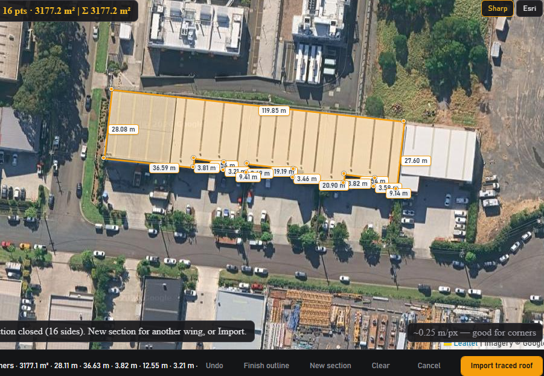
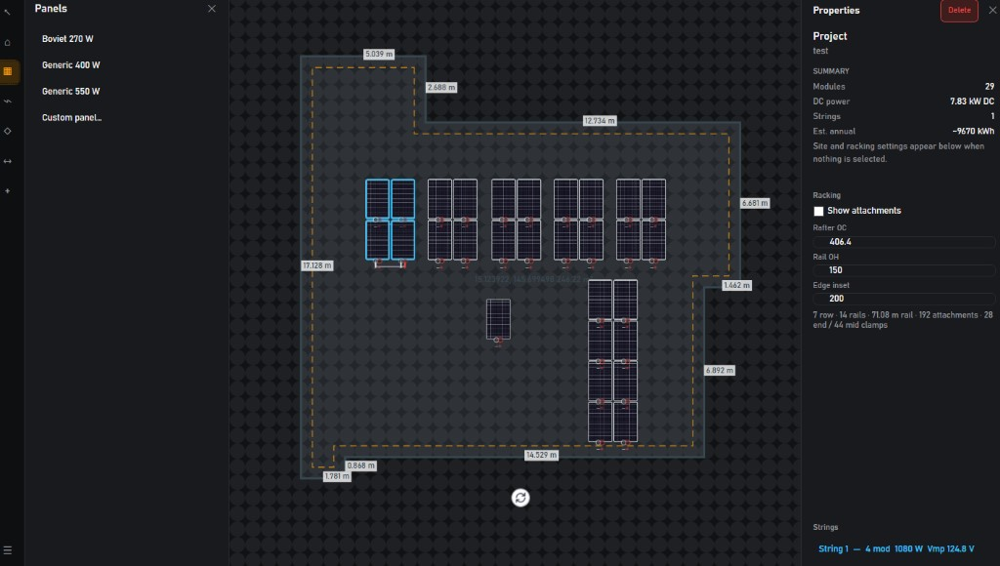
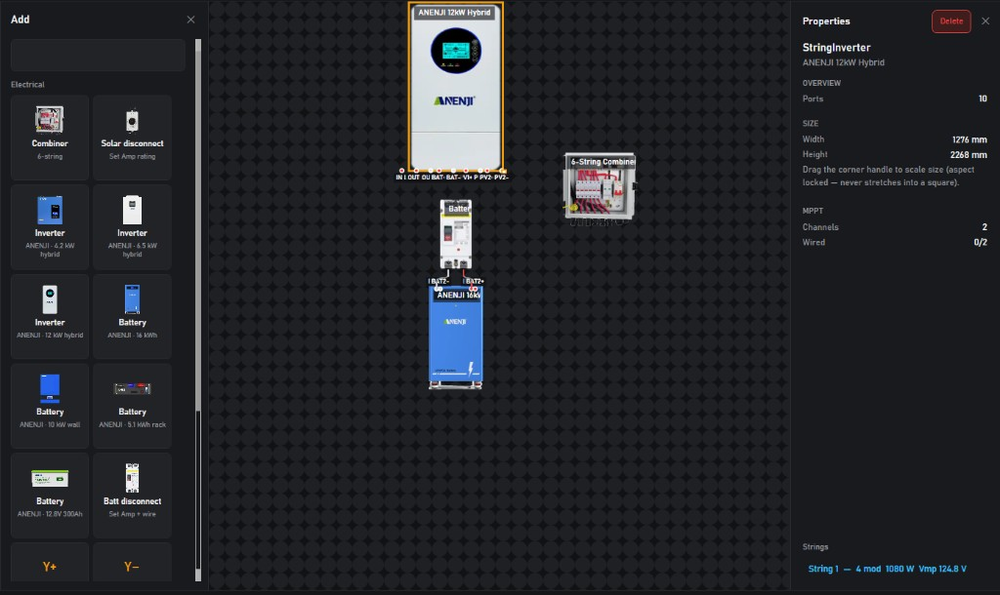

# solarSim

A visual solar design lab for Windows — still a **public beta**, still improving, built from the heart.

I started this because I believe in positive energy: people who care about solar but do not yet know every detail of the craft should still have a place to **learn, sketch, and see** how a system comes together. I am learning as I go. I am **not a certified electrician** — I only build what I know and keep learning. If something is wrong, confusing, or missing, please [open a GitHub Issue](https://github.com/Salutatorian/solarSim/issues). I will happily listen and improve.

**Owner:** Salutatorian — see [LICENSE](LICENSE) and [OWNERSHIP.md](OWNERSHIP.md).  
Download official builds from [Releases](https://github.com/Salutatorian/solarSim/releases). Please **do not fork** this repository; use Issues and stars instead.

This is a **design and simulation aid**, not electrical-code, structural, or bankable-yield approval. **Your projects stay on your computer** — solarSim does not sync designs to any cloud.

---

## What you can do

### 1. Trace your real roof from satellite

Scan / outline your house on the map and **import a near–real-world size** footprint so panel planning matches the roof you actually have — not a guessed rectangle.



- Open **Trace roof on map…** (WebView2 + satellite imagery)
- Click corners to outline; drag handles, Undo, and live edge lengths while you work
- Use **New section** for L / T / multi-wing roofs
- **Import traced roof** brings the polygon onto the canvas at scale (with straighten + lock so you can place modules without nudging the house)

### 2. Place modules your way — and see strings light up

Drop panels at **real width × length**, with the **wattage** and electrical settings of your plan (Vmp, Voc, Imp, Isc, cold Voc / hot cell, and more). Wire them into strings and the UI shows which modules belong together.



- Catalog panels (e.g. Boviet 270 W) or **Custom panel…** for your own size and watts
- Magnetic snap, rotate, duplicate; roof **setbacks** and edge lengths on the canvas
- Connect **PV+ / PV−** into series strings — the string highlights on the roof and appears in the **Strings** list (bottom right / inspector)
- Live project summary: module count, DC power, string count, rough annual kWh estimate
- Optional racking helpers (rails, attachments, clamps) as a design aid

### 3. Design the indoor electrical gear

On the **Equipment** plan, lay out the “back of house” — inverter, battery, disconnects, combiner — and wire them like a schematic.



- Place **inverters** (including ANENJI hybrids), **batteries**, **solar / battery disconnects**, **combiners**, AC gear, and MC4 Y branches
- Drag ports to connect; Smart Wiring keeps routes ortho and out of equipment bodies
- Inspector shows ports, size (aspect-locked resize), MPPT channels, and more
- Keep roof module work on **Roof** and gear on **Equipment** (a combined System view is planned for later)

---

## Stack

| Layer | Technology |
|--------|------------|
| Application shell | Unity + C# + UI Toolkit → Windows `.exe` (Phase 0.9 lab) |
| Domain / electrical engine | Pure C# (`.NET 8`) — testable without Unity |
| Desktop preview | WPF (`Launch-solarSim.bat`) — full roof/equipment/BOM features |
| Optional yield | Python/pvlib bridge (`Tools/pvlib_estimate.py`) when installed |
| Future | Cesium for Unity, SQLite, Unity feature parity |

## Repository layout

```
solarSim/
  src/SolarSim.Domain/         Electrical graph, calculations, equipment models
  src/SolarSim.Application/    Project state, commands, serialization, units
  tests/SolarSim.Domain.Tests/ Unit tests for topology + math
  UnityProject/                Unity client (open in Unity Hub)
  Tools/                       Domain→Unity sync, optional pvlib script
  ARCHITECTURE.md
  CHANGELOG.md                 Phase history (for review / submission)
  README.md
```

## Run / test it yourself (works now)

**WPF Panel Lab + full roof/equipment/BOM (fastest):**

```
Launch-solarSim.bat
```

### Download a Windows build (Releases)

Public beta builds ship on every `v*` tag:

1. Open [Releases](https://github.com/Salutatorian/solarSim/releases) (latest: **v0.1.31**)
2. Download `solarSim-<version>-win-x64.zip`
3. Unzip and run `solarSim.exe`

Windows may show **SmartScreen / Defender** warnings because builds are not Authenticode-signed yet. That is expected for a new public-beta `.exe`. Choose **More info → Run anyway**, or allow the folder under Windows Security. The app only contacts GitHub Releases for updates; projects stay local.
4. Optional: ⋯ → **About solarSim…** for disclaimer + WebView2 note

**Requirements:** Windows 10/11 x64 · [WebView2 Runtime](https://developer.microsoft.com/microsoft-edge/webview2/) (for **Trace roof on map**)

**Public beta notes**
- Design / simulation aid only — not stamped electrical, structural, or bankable-yield approval
- Map tracer needs internet + WebView2; offline → use **Draw roof**
- Imported roofs lock after straighten so marquee selects panels (Unlock to edit geometry)
- Smoke checklist before tagging: [SMOKE.md](SMOKE.md) · release process: [RELEASE.md](RELEASE.md)

Local package without tagging:

```powershell
.\Tools\Publish-Windows.ps1
```

**Unity shell (Phase 0.9 Panel Lab):**

```
Launch-Unity.bat
```

Then in the Editor: **solarSim → Setup Main Scene** (once if needed) → **Play**.

Or from a terminal:

```powershell
cd C:\Users\JW\Desktop\projects\solarSim
dotnet run --project src\SolarSim.Preview\SolarSim.Preview.csproj -c Release
```

This opens the **Solar Panel Lab** desktop preview (same electrical engine as the Unity app). You can:

1. Add **Boviet 270 W**
2. **Ctrl+D** to duplicate
3. Drag panels — edges magnetically snap
4. Hover a panel → red **PV+** / blue **PV-**
5. Drag **PV+** to the other panel’s **PV-**
6. Watch the status bar jump to **540 W / 62.4 Vmp / 76.2 Voc**
7. Place a **6-String Combiner** and wire string ends into S1+/S1−
8. Click a home-run wire → inspector shows estimated voltage drop
9. **Ctrl+Z** / **Ctrl+Shift+Z** undo/redo
10. **Save** / **Open** `.solarproj`

| Input | Action |
|--------|--------|
| LMB drag panel | Move (snaps) |
| LMB drag port | Wire |
| Wheel | Zoom |
| Middle-drag / Space+drag | Pan |
| Ctrl+D | Duplicate |
| R | Rotate 90° |
| Del | Delete |
| Alt (hold) | Disable snap |

> WPF preview (`Launch-solarSim.bat`) has the full roof / equipment / racking / BOM surface. Unity (`Launch-Unity.bat`) is the Phase 0.9 Panel Lab shell — same electrical engine, orthographic canvas + UI Toolkit.

## Current status

Full phase-by-phase history: **[CHANGELOG.md](CHANGELOG.md)** (keep updated for submission / review).

**Phase 0.1 — Solar Panel Lab:** done (panels, wiring, live math, select/delete, save/load)

**Phase 0.2 — Manual roofs:** done (+ later upgrades)
- Draw roof polygon with **90°/180° ortho snap** (hold Alt to free-draw)
- **Live edge measurement** while drawing
- Length units: **mm / m / ft / ft-in / yd / in**
- Multi-roof layers for L/T/complex footprints (**New Roof Layer**, **Demo L-Roof**)
- Photoshop-style **Layers** panel (Roofs / Panels / Equipment)
- Setback, obstacles, panel containment

**Phase 0.3 — Combiners / strings / voltage drop:** done

**Phase 0.4 — Inverters / MPPT mapping:** done

**Phase 0.5 — AC side / single-line:** done
- **AC Disconnect** + **AC Load Center** equipment
- **Single-Line** inspector summary (modules → strings → inverter → AC)
- `.solarproj` `schemaVersion: 5` (multi-roof + units)

**Phase 0.6 — Cold Voc / temp derating / string sizing:** done
- Site **Cold Voc** / **Hot cell** temps (°C) in sidebar
- Module temp coefficients on catalog panels; cold Voc / hot Vmp in inspector
- MPPT checks use **cold Voc** vs max DC and **hot Vmp** vs MPPT window
- Series string length advice (min–max modules) on inverter select
- `.solarproj` `schemaVersion: 6` (+ site temps)

**Phase 0.7 — Wire routing + BOM:** done
- **Double-click** a wire to add route bends; drag handles (ortho snap, Alt = free)
- Wire length follows the routed polyline; Del removes bend then wire
- **BOM / Wire Schedule** button → modules, equipment, wire runs by gauge
- `.solarproj` `schemaVersion: 7` (+ waypoints)

**Phase 0.8 — Attachment / racking layout helpers:** done
- Estimate **rails**, **attachments**, **end/mid clamps** from placed modules
- Roof sidebar: rafter OC / rail overhang / edge inset + **Show attachment points**
- BOM includes racking line items; design aid only (not structural)
- `.solarproj` `schemaVersion: 8` (+ racking params)

**Phase 0.9 — Unity shell parity (Panel Lab):** done
- Orthographic canvas: place / snap / select / rotate / duplicate / delete modules
- PV+ → PV− wiring with polarity-colored leads + live status bar
- UI Toolkit chrome: library, inspector, strings, undo/redo, save/open `.solarproj`
- `Launch-Unity.bat` + menu **solarSim → Setup Main Scene**
- WPF preview remains the primary full-featured design UI

**Phase 1.0 — Reports / PDF one-line + array layout sheets:** done
- **Export Report (HTML/PDF)** → printable HTML with single-line, SVG array layout, module schedule, racking, BOM
- Open in browser → **Ctrl+P → Save as PDF**
- Design aid only — not a stamped permit package

**Phase 1.1 — Batteries + DC disconnects:** done
- **Battery** (BAT+/BAT−) and **Battery Disconnect** on the canvas
- **DC / PV Disconnect** renamed in UI (array-side disconnect already existed)
- Single-line **Storage** line + battery path; BOM picks up equipment automatically
- Design aid only — not a stamped energy-storage package

**Phase 1.2 — Site / weather assumptions:** done
- Site panel: **location**, optional **lat/lon**, cold Voc / hot cell, **peak sun hours**, **system derate**
- Climate presets (Sydney, Melbourne, Brisbane, Phoenix, Minneapolis, temperate)
- Rough annual energy = STC kW × PSH × derate × 365 (shown on single-line + HTML report)
- `.solarproj` `schemaVersion: 9` (+ site fields)
- Design aid only — not TMY / pvlib / bankable yield

**Phase 2.0 — Google Solar API roof import:** done
- Roof sidebar: **Import Google Solar Roof** (address or `lat,lon`)
- **Set Google API Key…** → `%LOCALAPPDATA%\solarSim\google-api-key.txt` (or env `SOLARSIM_GOOGLE_API_KEY`)
- Imports roof-segment bounding boxes as roof layers; fills site lat/lon + peak sun hours
- Design aid — segment boxes are approximations, not surveyed footprints

**Phase 2.4 — Satellite house picker:** done
- **Trace roof on map…** / empty-state **Trace on map**: WebView2 + Leaflet; **Google satellite** by default (sharper), Esri fallback toggle — no Google billing for this path
- Search (OpenStreetMap) or paste lat,lon → zoom → click corners → **drag handles**, Undo/Ctrl+Z, live edge lengths (m)
- **New section** for L/T multi-wing roofs (imports as multiple roof layers)
- After import: edges auto-straightened + **locked**; Unlock to edit; Alt+drag moves roof when unlocked; ↻ rotate (90° magnet); corner drag snaps H/V (Alt = free)
- Canvas **Measure** tool (↔): live edge lengths like Draw roof
- Optional Google Solar API remains under ⋯ for power users

**Phase 2.1 — Detailed monthly production estimate:** done
- Site **tilt / azimuth** + latitude seasonality (NH/SH) for monthly kWh
- Single-line + HTML report show monthly table; schema **10**
- Pure C# design aid (pvlib-shaped) — not TMY / bankable yield

**Phase 2.2 — Optional Python / pvlib yield bridge:** done
- SITE: **Run pvlib yield (optional)** + **pvlib status…**
- Uses `Tools/pvlib_estimate.py` when Python + `pvlib`/`pandas`/`numpy` are installed
- Clearsky POA estimate → inspector; built-in C# estimate remains default for Single-Line / reports
- Install: `pip install pvlib pandas numpy`

**Phase 2.3 — Dark CAD HUD:** done
- Tabs: **Roof** · **Equipment** (combined System view deferred)
- Dark CAD HUD default; top-bar **Light** / **Dark** toggle

**Next:** Cesium / Unity roof parity · iterate public beta feedback

### Roadmap (remaining)

| Phase | Focus |
|-------|--------|
| R2–R3 | ✅ Windows `.exe` zip + GitHub Release workflow (`v0.1.0+`) |
| R1 / R4 | ✅ Stability polish + public beta cut (`v0.1.1`: About, WebView2 prompt, SMOKE.md) |
| Later | Cesium for Unity 3D site · Unity roof/equipment parity |

## Domain notes

## Run domain tests

Requires [.NET 8 SDK](https://dotnet.microsoft.com/download).

```powershell
cd C:\Users\JW\Desktop\projects\solarSim
dotnet test
```

Expected: all tests pass, including the demo scenario math:

| String | Pmax | Vmp | Voc | Imp | Isc |
|--------|------|-----|-----|-----|-----|
| 2 × Boviet 270 W | 540 W | 62.4 V | 76.2 V | 8.65 A | 9.20 A |
| 3 × Boviet 270 W | 810 W | 93.6 V | 114.3 V | 8.65 A | 9.20 A |

## Opening the Unity project

1. Install [Unity Hub](https://unity.com/download).
2. Install **Unity 6 LTS** (or **2022.3 LTS**) with **Windows Build Support**.
3. Hub → **Open** → select `UnityProject/`.
4. First open may generate Library/ and ask to import UI Toolkit packages (already listed in `Packages/manifest.json`).

Until Unity is installed, you can still develop and verify the electrical engine with `dotnet test`.

## Phase 1 demo sequence (target UX)

1. Add Boviet 270 W  
2. Duplicate  
3. Snap panels edge-to-edge  
4. Drag PV+ → PV−  
5. MC4 lock animation  
6. Status bar: `2 Panels | 540 W | 1 String | …`  
7. Connect a third panel → `810 W`  
8. Ctrl+Z / Ctrl+Shift+Z  
9. Save `TestArray.solarproj` and reload  

## Controls (planned)

| Input | Action |
|--------|--------|
| LMB | Select / move |
| Drag empty | Box select |
| MMB or Space+LMB | Pan |
| Wheel | Zoom to cursor |
| R | Rotate 90° |
| Ctrl+D | Duplicate |
| Delete | Delete |
| Ctrl+Z / Ctrl+Shift+Z | Undo / Redo |
| Ctrl+S | Save |
| Alt (held) | Disable snap |

## Add a built-in panel definition

In domain code (or later via ScriptableObject assets):

```csharp
var def = new SolarPanelDefinition(
    id: Guid.NewGuid(),
    manufacturer: "Acme",
    model: "450 W",
    pmaxWatts: 450,
    vmpVolts: 41.0,
    impAmps: 10.98,
    vocVolts: 49.5,
    iscAmps: 11.60,
    widthMm: 1134,
    heightMm: 1900);
```

Register on `SolarProject.Definitions`. Visual skins never override electrical data.

## Extending electrical components

Future combiners, inverters, and batteries implement `IElectricalComponent` with multiple `ElectricalPort`s and join the same `ElectricalGraph`. Do not special-case panel wiring as a one-off system.

## Safety notice

Results are simplified engineering estimates. They do not constitute professional engineering approval or electrical-code compliance.
